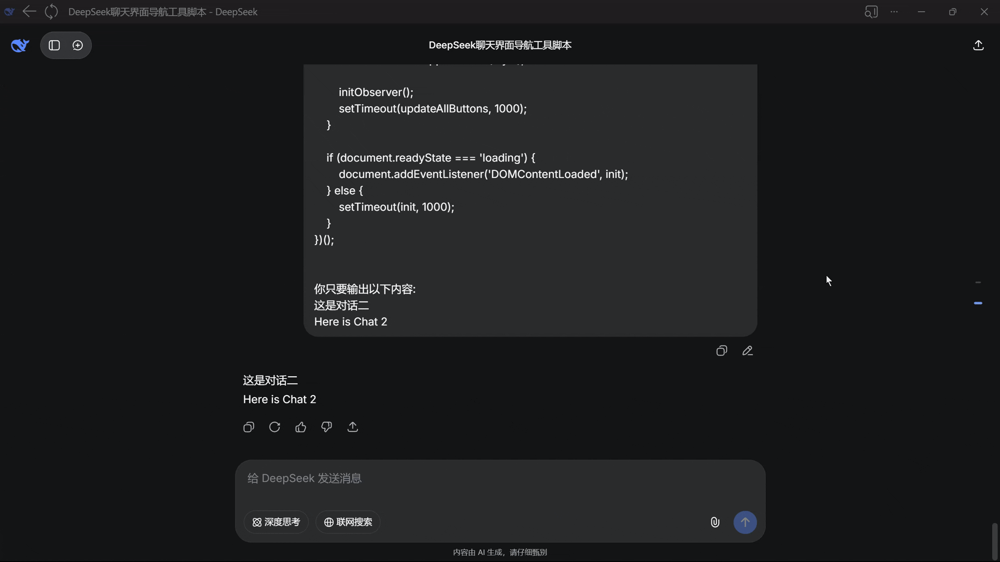

# DeepSeek Quick Navigation Tool

[中文](#中文) | [English](#english)

---

## 中文

### 功能简介
DeepSeek 快速定位工具是一个油猴脚本，专为 DeepSeek 网页版聊天界面设计。在原有的对话定位功能基础上，进一步优化用户体验，帮助用户快速定位到 AI 的回答输出位置。

### 开发背景
DeepSeek 网页版已有定位到每段对话开始位置的功能，但当用户输入较长内容时，AI 的相应回答可能会出现在页面较下方，需要滚动较长时间才能找到。本脚本解决了这个问题，让用户可以一键跳转到对应的 AI 回答位置。

### 安装方法
1. 安装油猴脚本管理器（Tampermonkey 或 Violentmonkey）
2. 点击脚本管理器的"添加新脚本"
3. 复制完整脚本代码并保存
4. 刷新 DeepSeek 网页版页面

### 使用方法
1. 打开 DeepSeek 网页版聊天界面
2. 在每个用户输入框上方会出现 "Chat 1"、"Chat 2" 等按钮
3. 点击按钮即可直接跳转到对应的 AI 回答位置

---

## English

### Feature Overview
DeepSeek Quick Navigation Tool is a Tampermonkey script designed specifically for the DeepSeek web chat interface. Building upon the existing conversation navigation features, it further enhances user experience by helping users quickly locate AI response positions.

### Development Background
While DeepSeek web version already has functionality to navigate to the beginning of each conversation, when users input lengthy content, the corresponding AI responses may appear further down the page, requiring significant scrolling to find. This script addresses this issue by allowing users to jump directly to corresponding AI responses with a single click.

### Installation
1. Install a userscript manager (Tampermonkey or Violentmonkey)
2. Click "Add new script" in the script manager
3. Copy and paste the complete script code, then save
4. Refresh the DeepSeek web chat page

### Usage
1. Open the DeepSeek web chat interface
2. Buttons labeled "Chat 1", "Chat 2", etc., will appear above each user input container
3. Click any button to jump directly to the corresponding AI response position
